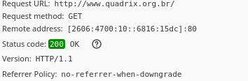

# Request
A request happens when a browser try to access a server. Like when you access https://github.com/magrinibruna you are doing a request to the GitHub server.

# Response
A response is when the GitHub server responds your request. So, you send a request to GitHub server when try to access https://github.com/magrinibruna and the GitHub server responds with the html page with the content, that is the response.

# HTTP vs HTTPS
Both HTTP and HTTPS are protocols that determine how client and server should communicate. 

A HTTP protocol is commum the port 80.
(https://gitbook.ganeshicmc.com/web/semana-1/protocolo_http)

A HTTPS protocol is the HTTP + TLS (currently we call TLS as SSL/TLS). This protocol provides a new layer of security.   
The new layer of security provides data authentication and encryption that it didn't exist in HTTP (when we intercept a HTTP protocol, we can read what is happening because is plaintext).  
The commum port is 443.


(https://gitbook.ganeshicmc.com/web/semana-1/protocolo_https)

> References: https://docs.oracle.com/cd/E19226-01/820-7627/bncbs/index.html

# URL
To do a request to a webserver, you need to use URL.


## Flow of request and response
In HTTP/1.0,  each request would generete a three-way hand-shake

  


That took a long time, and because that, in HTML/1.1, a connection can keep-alive to avoid more three-way handshake.


The image above is how things happen now. A client starts a request and after the three-way handshake, the client starts to ask information and the server starts to send a response.

> References (request flow and HTTP/1.0 vs HTTP/1.1): https://hpbn.co/http1x/

We can capture the packages to see all this happening. In this part, I will use things about Network, if you didn't see the section about tshark and termshark, I strongly recommend you see. If you don't want to see, you can just jump, I will only show this flow in practice.
You will need termshark and tshark installed. In Manjaro (if you use other distribution, you can find in the Google how to install):
```
sudo pacman -S tshark
sudo pacman -S wireshark-cli
```

To start capturing the packages:

```
# You have to create a file 
# and give all permissons of -rw-rw-rw- to the file
sudo tshark -w packages.pcap

# It may be need to set the interface of the internet. 
# You can see all with
ifconfig

# To execute the wifi, I do
sudo tshark -i wlo1 -w packages.pcap
```

Now, you are capturing packages. You need to access a website. 
Because all rules about HTTPS and access of tshark, I will access a website that doesn't have a SSL/TLS certificate. A HTTPS has one more layer of security and this layer encripted the communication between server and client. HTTP doesn't encrypt and because of that, we can see in plaintext all datas when we intercept a package. If we intercept a HTTPS communication, we wouldn't be able to understand without decripying.
Besides that, I need to do this with curl insted of using the browser because if I use the browser, the package HTTP won't be captured (https://osqa-ask.wireshark.org/questions/37704/wireshark-not-showing-http-protocols).
```
curl http://<website>
```
After the site loaded, I stopped capturing packages.

My packages.pcap has the request/response flow. Too see:
```
termshark packages.pcap
```


Let's see the packages.
Here is the three-way handshake. You can see the [SYN] in the line 17 and after gets the IP of website server in DNS it's inicialized the conection with the [SYN, ACK] in the line 24 and the [ACK] in the line 26. 
You can also see the DNS search (19 until 22) and the GET sended (line 26).

I'm acessing http://www.quadrix.org.br/ because doesn't have a SSL/TLS certificate. To find this site I just searched in the Google "http sites".
To see the packages transfered between the server and the client, we can access the site used to capturing packages in the browser and: ```CTRL + Shift + I -> Network Tab.``` After that, recharge the page. You will see something like this:


This page has all the request and response made by client and server. In this case, 78 request were made and we can see the headers and more information about each request in the side (we will se more in next sections). Each request is to a HTML, CSS, Javascript file or images, icons and etc that the pages uses. We can also see this in the captured packages.
A package that returns the HTML:


A package that returns the CSS:


And you can find all the others pages. If you would like to explore more, here is the [.pcap](./aula01/request-response.pcap)


References:
> https://packetpushers.net/using-ssldump-decode-ssltls-packets/  
> https://reberhardt.com/blog/2016/10/10/   capturing-https-traffic-with-tshark.html  
> https://osqa-ask.wireshark.org/questions/37704/  wireshark-not-showing-http-protocols  

# Headers
In a request, the client can send a header and the server can responds with a header too. A header is a additional text that has informations about the request. 

Communication between Client -> Server


Essentially there is:
- The method used: GET
- The URL requested: /request.1html
- THe protocol and the version: HTTP/1.1
- Host: example.com

Communication between Server -> Client


Essentially there is:
- The protocol and the version: HTTP/1.1
- Code response: 200 OK (success)
- Content-Length: 234

There are others headers that can be sended by client or server. And to each request, there are its headers, this because the protocol is TCP and it says that each request is somethind individual and the browser knows that and works with the response this way. Here is an example of our website used in the package capture. There is the response headers and the request headers. 

  


This header can have a lot of information, like:
- Host: it's the server that will receive the request
- Port: Port (remote address) that we are using to access the website. The port 80 is the pattern to HTTP protocol and 443 is the pattern to HTTPS protocol. Of couse, the server can configure a website in port :8081 and you will use this port to connect to the server
- User-Agent: informations about the computer and the browser used to do the request
- Accept: informe to the server what kind of dates can be responded
- Connection: define if the connection can be close or not (if closed, it's necessary to do a three-way handshake in the next request)

You can see more about headers [here](https://www.w3.org/Protocols/rfc2616/rfc2616-sec14.html) and [here](https://developer.mozilla.org/pt-BR/docs/Web/HTTP/Headers).

# Body
The body, in a response, has the information asked by the client. So in the header, you have configurations informations and in the body, you have the information. Example, if you asked in the request to /index.html, in the response body, you will have the content of the file.


The body can also exist in a request. The body is used to send informations when it's used a different method like POST (until here we were using GET).

There are a lot types of bodys. I recommend: 
> https://developer.mozilla.org/en-US/docs/Web/HTTP/Messages  
> https://developer.mozilla.org/en-US/docs/Web/HTTP/Basics_of_HTTP/MIME_types  
> https://developer.mozilla.org/en-US/docs/Web/HTTP/Methods/POST  
> https://gist.github.com/joyrexus/524c7e811e4abf9afe56  
> https://gist.github.com/subfuzion/08c5d85437d5d4f00e58  

References:
> https://developer.mozilla.org/pt-BR/docs/Web/HTTP/Headers  
> https://www.w3.org/Protocols/rfc2616/rfc2616-sec14.html  

# Methods
The methods are conventions established by the protocol that defines the type of request. There are a lot: GET, POST, HEAD, PUT, DELETE, CONNECT, etc. But this is only conventions, and the server can say that a GET request is a POST request and whatever it wants (this is only weird).

- GET: This method requests content from the server. This was the method we see until here, because we only request contents (HTML, CSS, images, etc).
  
A GET method can send informations to the server, but it is sended in the URL (URL params).

- POST: This method is used when you want to send content to the server. A example is when you do a login, you need to send to the server your username and password to authentication (this example I did in Chrome because Firefox wasn't showing the body).
  
  
  
Here are the query string parameters. There parameters are in the URL (http://www.quadrix.org.br/atendimento.aspx?mode=ok&pageId=62)
    
And here is the body of the request. I send a POST using the attendance page, so has some fields about me and my message.
  
field_name, field_cpf, field_email, field_contest and field_message are the text in the inputs.
  
Different of GET that sends the information in the URL, the POST method sends the information in the requisition body.

## Flow of methods
Here is GET being sended with some params in the URL and we also have a POST with informations but sended in the request body (we usually call the information sended in a POST as Payload)


# Everything working together
Now, let's see more about this all works in practice. We will use Burp Suite that is a application that lets us to intecept the requests. To [download](https://portswigger.net/burp/communitydownload)

If you are in a Linux:

```
cd ~/downloads
chmod +x burpsuite*
./burpsuite*
``` 
Install and open. This is probably what you will see:


Now, set your browser to intercepts the request using [this tutorial](https://portswigger.net/burp/documentation/desktop/penetration-testing/configuring-your-browser) and after that, we can continue. Every time you want to intercept with Burp, you will need to do all this configurations. To avoid that, you can use a extension like FoxyProxy.

Now, in Burp Suite Community, ```Proxy -> Intercept``` and now we started to intercept requests. The request only will go to the server when we ```Forward``` or it won't go if we ```Drop```. Try to access the site used by you in this tutorial.

After starting intercepting and access the website (http://www.quadrix.org.br/), the request will open here. We can see the informations about the request.


But we can also intercept responses from the server. To do this, after you intercept a request, ```Action -> Do intercept response``` and when ```Forward```, the response will be intercept.

  
  

Because that a lot of response must be made, it will be intercept multiple responses.

# Status code
When a server responds, it sends status code that tells what happens. Some codes are:
- ```1XX```: Represents a information. When you receive this code, is only to inform something about the request
- ```2XX```: Represents success in the comunication
- ```3XX```: Represents that the browser will need to be redirected
- ```4XX```: Represents a client error
- ```5XX```: Represents a server error

To see in practice, we can execute a DirBuster. To install, click [here](https://sourceforge.net/projects/dirbuster/) and [here](https://www.youtube.com/watch?v=4Kxg5rAHKjY) is a tutorial, extract the file and execute DirBuster with the command

```
java -jar DirBuster-0.12.jar
```

DirBuster is a penetration tool to descover public files in a website. By passing the URL and a file with comuns paths (I will use as the [file](https://github.com/digination/dirbuster-ng/blob/master/wordlists/_common.txt) or [file](./aula01/commom.txt), DirBuster will try to find routes


And here is all routes that DirBuster finded with the status code returned by the route

