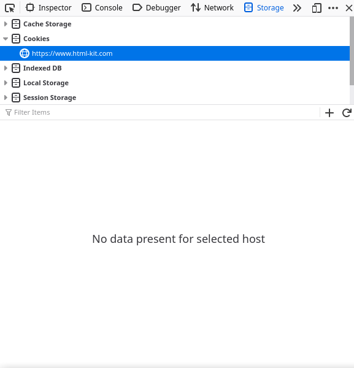
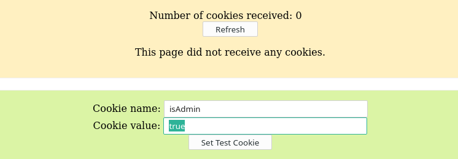
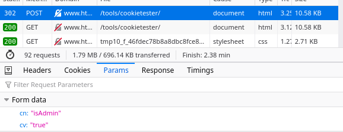
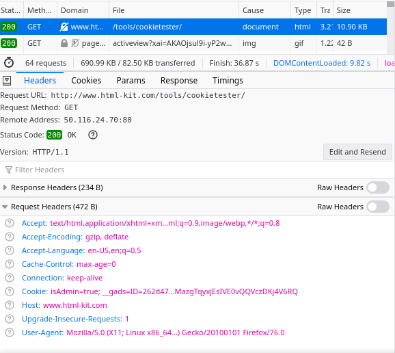
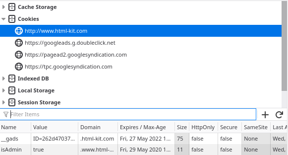
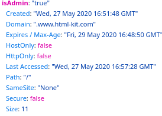
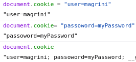

# Cookies

A cookie is a file text very simple that the content depends on the visited website. A website needs to store some user preferences like black mode, colors, languages, sessions (like a token that keeps the user logged in a computer) and etc. A good way to do that is stored a cookie with that preferences.   
When you visite a website the first time, the website sends some cookies that will be stored in your computer (and browser) until the expiration date. While the cookie doesn't expired, every time you access the website, the browser will send the cookies to the server and some configurations will be define automatically.

To see in practice, let's use the [cookie tester](https://www.html-kit.com/tools/cookietester/).

In the first time I access the CookieTester, I don't have any Cookie associeted to this website



Let's create a cookie



In our POST request, we are sending this Cookie Name (CN) and the Cookie Value (CV)



And as the response of the server, it sets the cookies (Set-Cookie header)



Now, every time we access CookieTester, the Cookie "isAdmin=true" will be there. Try to reload the page and see in the Storage tab



Now, because the site has Cookies associeted. Every request we do to the server, the Cookies will be sended. if the path is similar If you see the GET to access the page, the Cookie will be sended


If we remove the Cookie from the browser, the request won't send the Cookie and it won't be listed

## Cookie struct
A cookie has some parameters:



- Name: name of the Cookie ```isAdmin```
- Value: value of the Cookie ```true```
- Created: data that the Cookie was created ```Wed, 27 May 2020 16:51:48 GMT```
- Domain: the website that the Cookie belongs to ```www.html-kit.com```
- Expires / Max-Age: when the Cookie will be deleted ```Fri, 29 May 2020 16:48:50 GMT```
- HostOnly: ```false```
- HttpOnly: it's true when the Cookie can only be modified in Requests and Response. If it's false, the Cookie can be seen and changed in Javascript ```false```
To change in Javascript:  


- LastAccessed: ```Wed, 27 May 2020 16:57:28 GMT```
- Path: The path that the Cookie belongs to. Any path that it's similar to this path, the Cookie will be sended in the request. Example: if the Cookie has path ```/login```, any request starting  with ```/login``` will have in the header the Cookie like ```/login/access``` or ```/login```. A request made to ```/access``` won't have the Cookie/
- SameSite: ```None```
- Secure: Represents that the Cookis only can be used and passed in HTTPS requests ```false```
- Size: ```11```

>More about it: https://www.editthiscookie.com/blog/2014/03/cookie-properties/

A comum hacking with Cookies is: a website can use a Cookie to store a Session. This way, everytime a user access the page, it will log automatically because the Cookie of the Session is sended to the Server and the Server logs the user. So, in this type of hacking, someone gets the Cookie of the Session and with it, can access your account from his computer. This hacking is the type Man-InThe-Middle because a person can capture the package when you access the website and this package sends the Cookie to the Server.

> To know more: https://owasp.org/www-community/attacks/Session_hijacking_attack